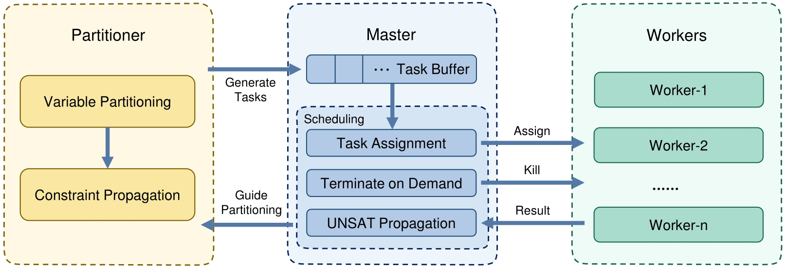

# AriParti: Distributed SMT Solving Based on Dynamic Variable-level Partitioning

Our open-source tool, AriParti, is available on [GitHub-AriParti](https://github.com/shaowei-cai-group/AriParti).

Built upon a dynamic parallel framework, AriParti employs variable-level partitioning in SMT solving, as detailed in our paper, *Distributed SMT Solving Based on Dynamic Variable-level Partitioning*.
Our approach is particularly tailored to arithmetic theories and is compatible with any SMT solvers capable of interpreting the `smt2` input format.

AriParti includes code from the Z3 project, which is licensed under the MIT License.

It is licensed under the [MIT license](LICENSE.txt).

## Cite this work

If you find AriParti useful in your research or wish to reference our approach, please use the following citation:

Mengyu Zhao, Shaowei Cai, Yuhang Qian (2024). Distributed SMT Solving Based on Dynamic Variable-Level Partitioning. In: Gurfinkel, A., Ganesh, V. (eds) Computer Aided Verification. CAV 2024. Lecture Notes in Computer Science, vol 14681. Springer, Cham. https://doi.org/10.1007/978-3-031-65627-9_4

## Requirements

AriParti has few dependencies.
It uses C++ runtime libraries.
Python is required to build the partitioner and run the Master `AriParti.py`.

- Python3
- gcc/clang (support C++17)
- cmake
- make
- GLIBC version >= 2.29

## Getting Started

### Build the Partitioner

Execute:

```bash
python scripts/build.py
```

The partitioner will be located in `bin/partitioner` after building.

### Test Instances

The `test-instances` are a set of straightforward instances carefully prepared so that users can conveniently test our tool. These instances cover various theories, encompass different levels of solving difficulty, and yield diverse results. Each test instance is named in the format `theory-result-cost_time.smt2`.

Moving on to `test-output-dir`, this temporary directory is designed for instance-testing output. For example, `lia-unsat-17.8.smt2` is generated by AriParti using 8 cores.

### Usage

The following are the explanations for the parameters of AriParti:

| Parameters          | Explanation                                                  |
| ------------------- | ------------------------------------------------------------ |
| --file              | The path to SMT instance, ending with .smt2.                 |
| --output-dir        | The path to the output folder for temporary and result files. |
| --partitioner       | The partitioner will be located in "bin/partitioner" after building. |
| --solver            | The path to the base solver. Three SMT solvers compared in the paper are placed in the bin/linux-prebuilt/base-solvers directory. You can also use any other solver with a standard input and output format. |
| --max-running-tasks | The maximum number of working processes (parallel core number).  |
| --time-limit        | Time limit returns 'unknown' if it exceeds the limit.       |

Here is an example illustrating the usage of AriParti:

```bash
python src/AriParti.py \
--file test-instances/lia-unsat-17.8.smt2 \
--output-dir test-instances/test-output-dir/ \
--partitioner bin/linux-prebuilt/partitioner \
--solver bin/linux-prebuilt/base-solvers/cvc5-1.0.8 \
--max-running-tasks 8 \
--time-limit 1200
```

It will output as follows format:
The first line is the solving result, and the second is the run time.

```bash
unsat
17.056430101394653
```

## Artifact Evaluation

### Basic Information

- Artifact: AriParti (**Ari**thmetic **Parti**tioning for Dynamic Distributed SMT Solving)
- Paper Title: *Distributed SMT Solving Based on Dynamic Variable-level Partitioning*
- Submission ID (Track AE-CAV2024): 9962
- Zenodo DOI: 10.5281/zenodo.10948392

We claim for available and reusable badges.
If it does not fulfill the reusable criteria, we claim the functional badge. 

### Structure and Content

The main components of our work primarily lie in `src/AriParti.py`, and the source code is located in the `src/partitioner/src` directory.



The Master in the framework outlined in Section 3 of our paper, responsible for managing and scheduling the entire distributed and parallel-solving process, is implemented in `AriParti.py`.

The partitioner, developed based on Z3, is primarily located in the `src/partitioner/src` directory.

The BICP and arithmetic level partitioning techniques mentioned in Section 4 are predominantly implemented in the `math/subpaving` directory, with a specific focus on the `subpaving_t_def.h` file and the `tactic/subpaving_tactic.cpp`.

The elements mentioned above are integrated within the subpaving module of Z3, allowing us to effectively implement functions such as performing enhanced BICP, selecting partitioning variables, variable-level partitioning, selecting and scheduling for partitioning tasks, and communicating with the Master.

Additionally, we have addressed some bugs that could impact the efficiency and performance of Z3.

### Evaluation Getting Started

A machine with a minimum of 16 cores is necessary to evaluate AriParti in a full experiment with our scripts. Furthermore, there are no specific requirements regarding the machine's performance.

Firstly, you need to obtain the number of CPU cores in your machine.

In Linux using Bash:
```bash
lscpu | grep "CPU(s):"
```

In Windows using PowerShell, you can use the following command:
```
(Get-WmiObject Win32_Processor).NumberOfCores
```

After obtaining the number of CPU cores in your machine, you can load the docker image and start the evaluation.

Bash:
```bash
docker load < docker/docker-ariparti-image
```

PowerShell:
```
docker load -i docker\docker-ariparti-image
```

Next, execute the following command (Please note that you should perform the following operations in the `AriParti-AE` directory):

Bash:
```bash
docker run -v `pwd`/AE-test-output:/AriParti/AE-test-output -v `pwd`/benchmarks:/AriParti/benchmarks:ro --rm -it docker-ariparti
```

PowerShell:
```
docker run -v ${PWD}\AE-test-output:/AriParti/AE-test-output -v ${PWD}\benchmarks:/AriParti/benchmarks:ro --rm -it docker-ariparti
```

The command above starts the docker container and places you in a bash environment, where you can inspect the source code or run the experiments.

`-v` option will mount `AE-test-output` folder in your current directory to the corresponding folder within the container where the evaluation results will be stored. This will allow you to view the generated output even after the container has stopped running.

Besides, it will mount `benchmarks` in a read-only mode to reduce the size of the provided docker-image.

`--rm` is an optional flag that creates a disposable container that will be deleted upon exit.

Then you need to enter the dir of our artifact:

```bash
cd /AriParti
```

To streamline the evaluation process for the reviewers, we have included an `evaluate.py` script in the `scripts` directory.

The main parameters of this script are as follows: 

- `--test-type`: contains three test types: `smoke`, `subset`, or `all`
- `--core-number`: the number of cores you have allocated to this docker on your machine
- `--time-limit`: the time limit assigned for each instance solving (in seconds)

To execute all the experimental tests provided in the `evaluate.py` script, it is estimated that you would require approximately 3.17 CPU years.
Given access to 16 cores, the overall duration amounts to roughly 72.39 days. For these reasons, you are advised to run a subset test instead of the complete benchmarks.

If you opt for a subset test, we have implemented a script to aid in  selecting a random subset of an input portion for testing purposes.
This test type has two additional parameters about random selection, namely:

- `--seed`: the random number seed
- `--ratio`: the proportion of the subset created from the benchmark for testing

If you have more computational resources to leverage, the outlined figures can be tailored to estimate the time required to test all instances and adjust the selection ratio accordingly.

Firstly, the `--test-type smoke` option allows you to detect any technical difficulties during the smoke-test phase.

Four instances are selected for each theory based on their solving time using CVC5, 0.01, 0.1, 1.0, and 10.0 seconds, respectively. This implies a total of 16 instances for the 4 arithmetic theories. Additionally, efforts have been made to ensure these instances are derived from varied categories and have both SAT and UNSAT results.

If your machine has `16` cores, you can run the following command to execute the smoke-test (which should take about 7 minutes):

```bash
python scripts/evaluate.py --test-type smoke --core-number 16 --time-limit 15
```

If finished successfully, the evaluation script should print at last:

```
Evaluation finished.
Cost time: HH:MM:SS
Results are located in dir AE-test-output
```

Then, we recommend running a subset test instead of running the complete set of benchmarks.

You can run the following command to execute the subset test with given parameters (which will take approximately 10.5 hours):

```bash
python scripts/evaluate.py --test-type subset --core-number 16 --seed 0 --ratio 0.02 --time-limit 30
```

You can choose different random seeds to generate various test subsets.

Given adequate computational resources and time availability, you can execute all experiments with a 1200-second time limit for each run. (with 16 cores, it should take about 1737.36 hours or 72.39 days) To test all by the following command:

```bash
python scripts/evaluate.py --test-type all --core-number 16 --time-limit 1200
```

After the evaluation is successfully completed, the experimental-related data will be stored in the `AE-test-output\TEST-TAG` folder. This folder primarily consists of the following five parts:

- `lists`: the instance lists of `TEST-TAG` evaluation
- `raw-results`: the results of every individual run of each solver for each instance
- `statistics`: the details of 4 distinct theories with a comprehensive summary of all theories
- `error-list.txt`: captures error solving during the evaluation, such as when one solver's result is `sat` while the others are `unsat`
- `TEST-TAG.log`: logs generated by `evaluate.py`

You can exit the container by typing `exit`. Output files generated by the evaluation script (logs, tables, etc.) remain available in `$PWD/AE-test-output`. Upon finishing your review, you can remove the image from the Docker environment using:

```
docker rmi docker-ariparti
```

### Experiment Details

#### Benchmarks

The experiments are carried out on four non-incremental arithmetic benchmarks from [SMT-LIB](https://smtlib.cs.uiowa.edu/), including:
1753 instances from QF_LRA, 13226 instances from QF_LIA, 12134 instances from QF_NRA, and 25358 instances from QF_NIA.

Due to recent access difficulties with The University of Iowa hosted GitLab for benchmarks at [SMT-LIB Benchmarks](https://clc-gitlab.cs.uiowa.edu:2443/explore/groups), we have to submit the relevant benchmark to Zenodo. This includes a whopping 1.8GB of QF_LRA theory instances, 3.2GB worth of QF_LIA theory instances, 5.6GB of QF_NRA theory instances, and 3.9GB of QF_NIA theory instances - adding up to a total of 14.5GB.

We provide lists of instances corresponding to each theory in the' benchmark-lists' folder. `QF_XXX-all_list-Instance_Number.txt` is a comprehensive list of all instances pertaining to the `QF_XXX theory`, essentially serving as the primary subjects under investigation in the first two parts of the Evaluation section.

In an additional filtration process, we have selected instances wherein all abstract Boolean variables have already been assigned post the Z3 preprocessing and Boolean constraint propagation. The `QF_XXX-pure_conjunction_list-Instance_Number.txt` is made the focal point in the third part of our tests, wherein we identify this collection as Pure-Conjunction instances.

#### Components

Our evaluation experiments on these benchmarks encompass the following:

- The sequential solving by three state-of-the-art SMT solvers: CVC5, OpenSMT2, and Z3.
- The parallel solving with our method on the three base solvers.

#### Base Solvers

- CVC5: https://cvc5.github.io/
- OpenSMT2: https://verify.inf.usi.ch/opensmt
- Z3: https://github.com/Z3Prover/z3

CVC5 and Z3 support all four arithmetic theories, and OpenSMT2 only handles two linear ones.

#### Parallel Strategies

Our study also conducted comparative experiments evaluating the two best partitioning strategies, as evaluated in [paper in FMCAD'2023](https://repositum.tuwien.at/bitstream/20.500.12708/188827/1/Wilson-2023-Partitioning%20Strategies%20for%20Distributed%20SMT%20Solving-vor.pdf), including decision-cube, the best strategy in CVC5, and scattering, the best strategy in [SMTS](https://github.com/usi-verification-and-security/SMTS/tree/cube-and-conquer), which is the parallel version of OpenSMT2.

However, please note that these aspects are not the core focus of our current evaluation, and integrating them would significantly swell the document content and prolong the testing duration.

If you're interested in exploring these further, the links provided below provide more information and instructions for configuration.

- [decision-cube](https://cvc5.github.io/blog/2023/12/15/partitioning-strategies-for-distributed-smt-solving.html) in CVC5
- scattering in [SMTS](https://github.com/usi-verification-and-security/SMTS/tree/cube-and-conquer) with OpenSMT2 

We sincerely thank Antti Hyvärinen and his team for their invaluable assistance during the comparative experiment of parallel strategies in OpenSMT2. Regarding partitioning with CVC5, we greatly appreciate Amalee Wilson's comprehensive guidance on using this module. We also thank her for her patient discussions and expert advice regarding the specific details we raised.

Given the intricate setup and comparison of these two parallel strategies and the already substantial costs of the existing experiments, these have not been included in this Artifact Evaluation process.

#### Results in the Paper

The directory `paper-experiment-results` contains all the experimental results mentioned in the paper *Distributed SMT Solving Based on Dynamic Variable-level Partitioning* by our servers.

All experiments are conducted on servers running Ubuntu 20.04.4 LTS, each with 1T RAM and two AMD EPYC 7763 CPUs with 64 cores per CPU. Each solver performed one run for each instance with a cutoff time of 1200 CPU seconds.

There are four theories in this dir, and four sum-up files `QF_XXX-Instance_Number-results-sumup.txt`.

The sum-up files are in a table format like this, following is the result of `QF_NRA-12134-results-sumup.txt`:

```
╒═════════════════════════╤═══════╤═════════╤══════════╤══════════╤═════════╕
│ solver                  │   sat │   unsat │   solved │   failed │   PAR-2 │
╞═════════════════════════╪═══════╪═════════╪══════════╪══════════╪═════════╡
│ cvc5-1.0.8-p1           │  5485 │    5811 │    11296 │      838 │ 2100561 │
├─────────────────────────┼───────┼─────────┼──────────┼──────────┼─────────┤
│ cvc5-1.0.8-p8           │  5559 │    5798 │    11357 │      777 │ 1948280 │
├─────────────────────────┼───────┼─────────┼──────────┼──────────┼─────────┤
│ cvc5-1.0.8-p16          │  5575 │    5796 │    11371 │      763 │ 1920929 │
├─────────────────────────┼───────┼─────────┼──────────┼──────────┼─────────┤
│ ArithPartition-cvc5-p8  │  5709 │    5864 │    11573 │      561 │ 1425236 │
├─────────────────────────┼───────┼─────────┼──────────┼──────────┼─────────┤
│ ArithPartition-cvc5-p16 │  5731 │    5864 │    11595 │      539 │ 1372485 │
├─────────────────────────┼───────┼─────────┼──────────┼──────────┼─────────┤
│ z3-4.12.1-p1            │  5626 │    5375 │    11001 │     1133 │ 2770153 │
├─────────────────────────┼───────┼─────────┼──────────┼──────────┼─────────┤
│ ArithPartition-z3-p8    │  5744 │    5686 │    11430 │      704 │ 1741660 │
├─────────────────────────┼───────┼─────────┼──────────┼──────────┼─────────┤
│ ArithPartition-z3-p16   │  5766 │    5705 │    11471 │      663 │ 1637352 │
╘═════════════════════════╧═══════╧═════════╧══════════╧══════════╧═════════╛
```

## Beyond the Artifact Evaluation

### How AriParti can be used in Different Environments

Python is needed to build the partitioner and run the Master in `AriParti.py`.

How to build the partitioner in different environments:
The partitioner is built on Z3, so it can be built the same as Z3:

#### On Windows

32-bit builds, start with:
```bash
python scripts/mk_make.py
```

or instead, for a 64-bit build:
```bash
python scripts/mk_make.py -x
```

then:
```bash
cd build
nmake
```

#### Using Make and GCC/Clang

Execute:

```bash
python scripts/mk_make.py
cd build
make
```

Note by default ``g++`` is used as the C++ compiler if it is available.
If you would prefer to use Clang change the ``mk_make.py`` invocation to:

```bash
CXX=clang++ CC=clang python scripts/mk_make.py
```

## Other Notes

Here are some other notes about the concept of 'distributed' as outlined in the title of our paper. Though our current tool is designed parallelly, the methodology proposed within our paper fundamentally supports distributed solving. Distributed solving can be achieved by assigning the partitioned sub-tasks to various computation nodes and then collating their solve results.
